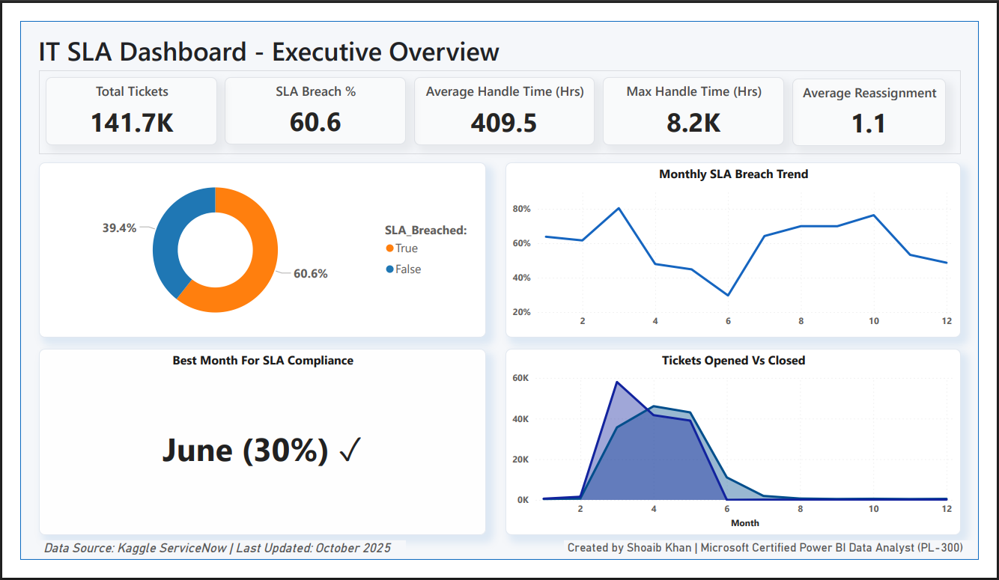
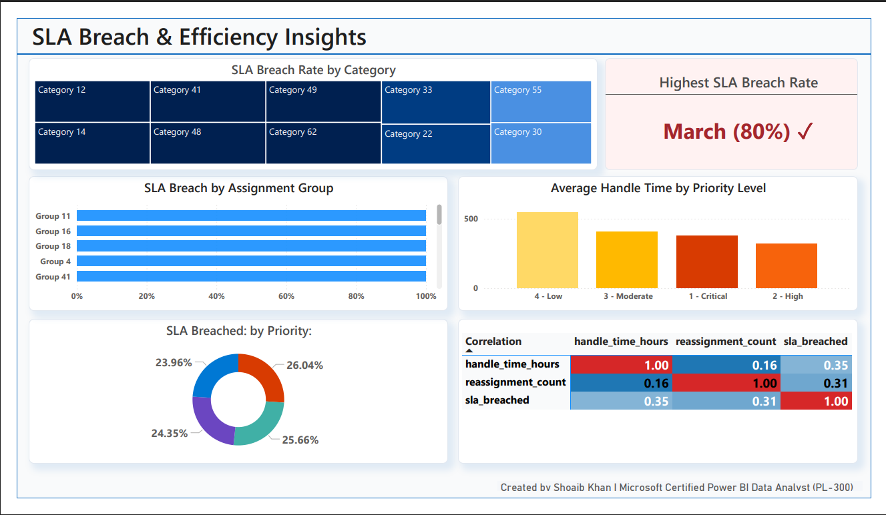
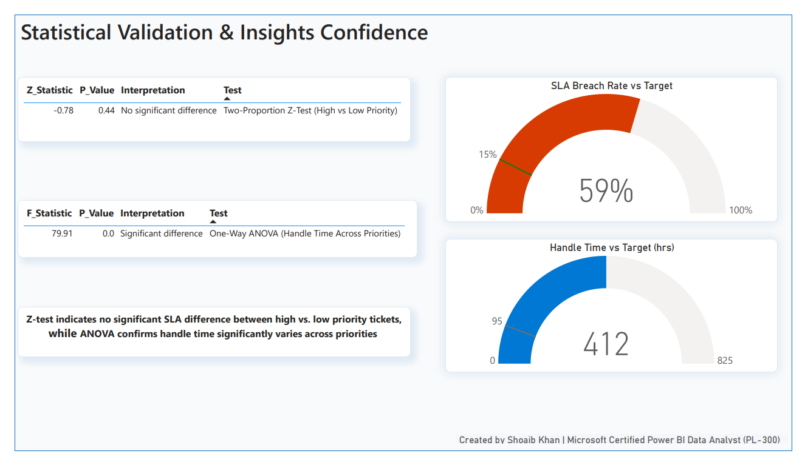

# ServiceNow IT Incident SLA Breach Analysis (Python + Power BI)

## 🧾 Project Overview  
This project analyzes **IT incident management data from ServiceNow (via Kaggle)** to identify where and why SLA breaches occur and how they can be reduced.  
It combines **statistical validation (Z-Test, ANOVA)** in Python with **interactive executive dashboards in Power BI**, offering a complete end-to-end data analytics case study for IT leadership.

---

###  🧰 Tools & Libraries  
- **Python**: Pandas · NumPy · Matplotlib · Seaborn · Statsmodels · SciPy  
- **Jupyter Notebook**: Interactive analysis, EDA, and hypothesis testing  
- **Power BI**: DAX · KPI/Trend Cards · Donut Charts · Correlation Matrix · Statistical Validation Gauges  
- **Dataset**: ServiceNow IT Incident Log (Kaggle), includes priorities, categories, handle time, and assignments  

---

### Project Flow  
1. **Data Preparation** – Loaded the incident CSV, parsed/cleaned dates, removed nulls, and calculated handle time (in hours).  
2. **Feature Engineering** – Created SLA breach flags, ticket priority categories, and reassignment counts.  
3. **Exploratory Data Analysis** – Examined breach vs compliance patterns, handle time distributions, and correlations.  
4. **Statistical Testing** –  
   - Ran *Z-Test* on SLA breach by priority (High vs Low).  
   - Ran *ANOVA* on handle time across multiple priorities.  
5. **Dashboard Design (Power BI)** – Built a 3-page Power BI report showing:  
   - Executive KPIs & breach trend  
   - Efficiency and group-level insights  
   - Statistical confidence and benchmark gauges  

---

###  🗂️  Dataset Summary  
- **Records:** 140,000+ incident records  
- **Key columns**:  
  `priority`, `category`, `assignment_group`, `opened_at`, `closed_at`, `handle_time_hours`, `sla_breached`, `reassignment_count`

---

### 📈 Key Insights & Statistical Findings
- The overall **SLA breach rate = 60.6%**, showing major compliance challenges.  
- The most compliant month was **June (30%)** according to Power BI analysis.  
- **Handle time varies significantly by priority (ANOVA F = 79.91, p < 0.001)**.  
- No significant difference in SLA breach rate between high vs low priority (Z = -0.78, p = 0.44).  
- **Moderate correlation (ρ ≈ 0.35)** between handle time and SLA breach rate → process delays are a key driver.

---

### Recommendations  
- Rebalance workloads between overloaded support groups.  
- Add proactive alerts for tickets nearing SLA limits.  
- Review SLA thresholds for lower priorities.  
- Investigate tickets with >500 hrs handle time to identify process blockers.  
- Use Power BI dashboard monthly to monitor SLA and handle-time trends.

---

### 📉 Business Impact  
- Fewer SLA breaches and faster ticket resolutions  
- Better customer satisfaction and SLA compliance  
- Higher team productivity with fewer delays  

---

###  📊  Power BI Dashboard Preview
| Page 1 | Page 2 | Page 3 |
| :--: | :--: | :--: |
|   |  |  |

---

👨‍💻 *Created by Shoaib Khan | Microsoft Certified Power BI Data Analyst (PL-300)*
